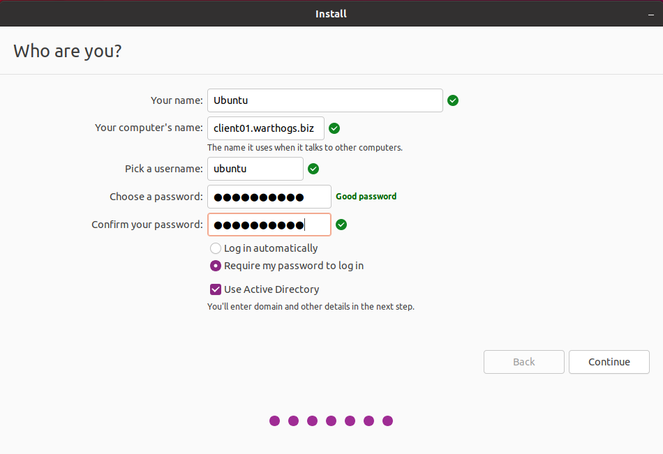
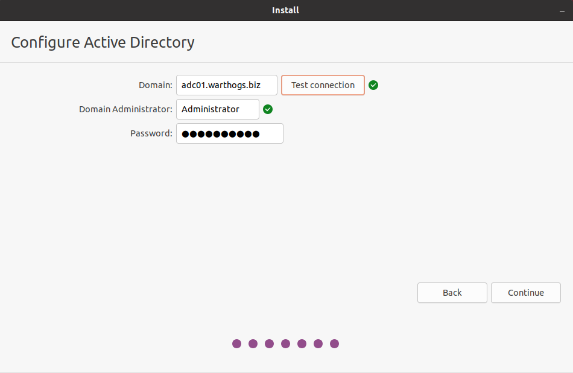

# How to join an Active Directory domain during installation

In order to use Group Policies on an Ubuntu client, the first thing to do is, of course, to join the computer to an Active Directory domain.

A machine can join an AD domain at installation time with the Ubuntu Desktop installer, or after installation, by manually setting up the connection to AD.

## Join at installation time

Joining during installation is only supported by the Ubuntu Desktop graphical installer Ubiquity. So, start an installation of Ubuntu Desktop as you would usually do and proceed to the page **"Who are you?"**. Enter user and computer name information.

> *Note about the host name:*
>
> *In order to set and resolve the host name properly, you must enter the **Fully Qualified Domain Name** (FQDN) of the machine in the field "Your computer's name". For example, `host01.example.com` instead of only the host name `host01`.*
>
> *After installation you can check if it is correct with the command `hostname` and `hostname -f` which must return the name of the machine (`host01`) and the full name of the machine with the domain (`host01.example.com`) respectively.*

Check the box **"Use Active Directory"** and click **"Continue"** to proceed with next step **"Configure Active Directory"**.

On this page you can enter the address of the Active Directory controller and credentials of the user allowed to add machines to the domain.

You can verify that the server is reachable by pressing **"Test Connection"**.

Once all the information has been entered and is valid, press **"Continue"** to proceed with the remaining usual steps of the installation.

At the end of the installation you can reboot the machine and you are ready to log in as a user of the domain on first boot.

If anything goes wrong with the join process during installation, you will be notified by a dialog box. You can still reboot the machine, log in as the administrator user of the machine (i.e. the user you entered in the page **"Who are you?"**) and troubleshoot the issue. The [Ubuntu Server Guide](https://ubuntu.com/server/docs/service-sssd) provides instructions to perform such troubleshooting.
